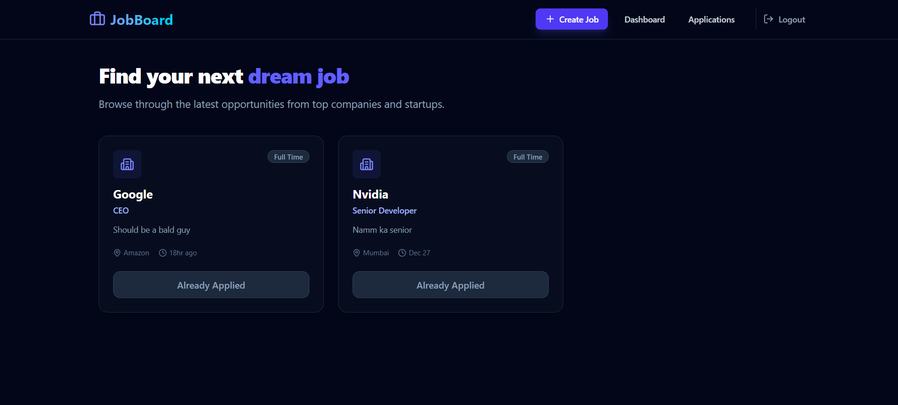
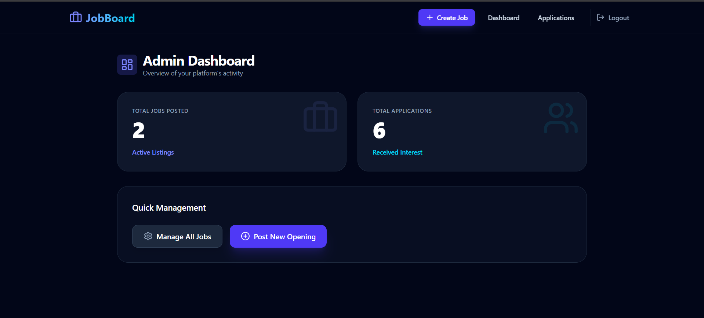
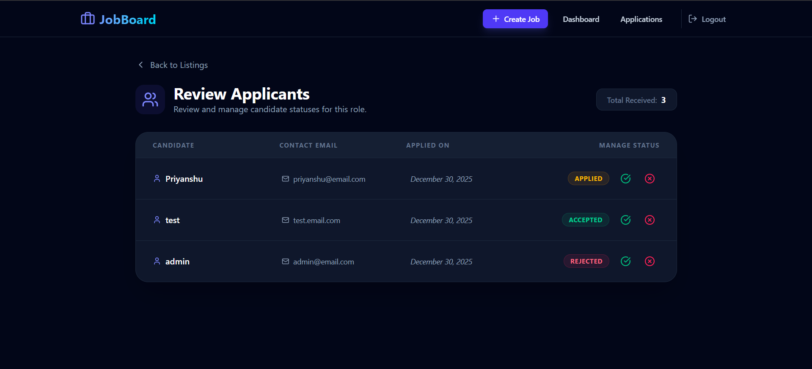
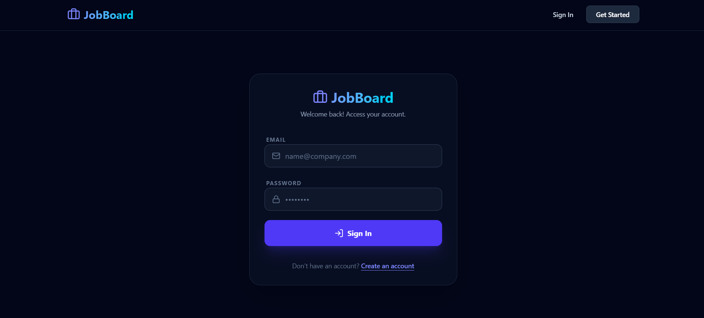

# 💼 JobBoard - Full-Stack Job Portal

**JobBoard** is a modern MERN (MongoDB, Express, React, Node.js) application designed for a seamless job search and recruitment experience. Featuring a "Deep Midnight" dark theme, the platform offers high performance, secure authentication, and a clean, accessible interface for both candidates and administrators.

---

## 🖥️ Screenshots

### 🏠 Candidate Home Page


### 📊 Admin Dashboard


### 🔑 Authentication (Review and change status)


### 🔑 Authentication (Login & Register)


---

## 🚀 Key Features

- **Dual-Role Functionality:** Distinct workflows and dashboards for Candidates and Admins.
- **Admin Command Center:** High-level overview of active jobs and total applications received.
- **Job Management:** Full CRUD operations allowing admins to post, edit, and delete job listings.
- **Application Tracking:** Candidates can monitor their application status (Pending, Accepted, Rejected) in real-time.
- **Secure Authentication:** JWT-based auth with password encryption using Bcrypt.
- **Optimized UI:** Built with Tailwind CSS and Lucide React icons for a responsive, modern feel.

---

## 🛠️ Tech Stack

### Frontend
- **React.js** (Vite)
- **Tailwind CSS** (Custom Dark Theme)
- **Zustand** (Global State Management)
- **Axios** (API Requests)
- **Lucide React** (Modern Iconography)
- **React Hot Toast** (Notifications)

### Backend
- **Node.js** & **Express.js**
- **MongoDB** & **Mongoose** (Database & Modeling)
- **JWT** (Secure Token-based Auth)
- **Bcryptjs** (Password Hashing)

---

## 📦 Installation & Setup

### 1. Clone the repository
```bash
git clone [https://github.com/Priyanshu-010/JobBoard](https://github.com/Priyanshu-010/JobBoard)
cd YOUR_REPO_NAME

2. Backend Setup
Navigate to the backend folder: cd backend

Install dependencies: npm install

Create a .env file and add:

PORT=3000
MONGO_URI=your_mongodb_connection_string
SECRET_KEY=your_jwt_secret

Start the server: npm run dev

3. Frontend Setup

Navigate to the frontend folder: cd ../frontend

Install dependencies: npm install

Start the app: npm run dev

---

## 👤 About the Developer

**Priyanshu Rai** 📧 [priyanshurai2772@gmail.com](mailto:priyanshurai2772@gmail.com)  
🔗 [LinkedIn](https://www.linkedin.com/in/priyanshuraidev/)  
💻 [GitHub](https://github.com/Priyanshu-010)

---